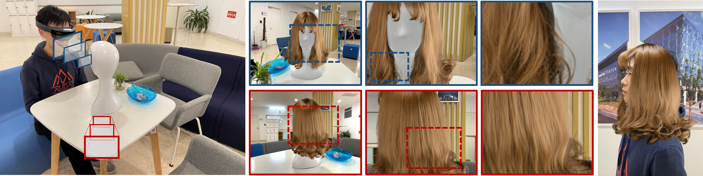

<!-- PROJECT LOGO -->
<br />
<p align="center">

  <h1 align="center">Convolutional Neural Opacity Radiance Fields </h1>

  <p align="center">
    
  </p>
  <p align="center">
    ICCP, 2021
    <br />
    <a href="https://HaiminLuo.github.io"><strong>Haimin Luo</strong></a>
    ·
    <a href="https://apchenstu.github.io/"><strong>Anpei Chen</strong></a>
    ·
    <a href=""><strong>Qixuan Zhang</strong></a>
    ·
    <a href=""><strong>Bai Pang</strong></a>
    ·
    <a href="https://wuminye.com/"><strong>Minye Wu</strong></a>
    ·
    <a href="http://xu-lan.com/"><strong>Lan Xu</strong></a>
    ·
    <a href="http://www.yu-jingyi.com/cv/"><strong>Jingyi Yu</strong></a>
  </p>

  <p align="center">
    <!-- <a href="https://pytorch.org/get-started/locally/"></a><br><br> -->
    <a href='https://www.computer.org/csdl/proceedings-article/iccp/2021/09466273/1uSSXDOinlu'>
      
    </a>
    <a href='https://haiminluo.github.io/publication/convnerf/' style='padding-left: 0.5rem;'>
      
    <a href='https://www.youtube.com/watch?v=YrdsulYTXzA&t=1s' style='padding-left: 0.5rem;'>
      
    </a>
  </p>
</p>

<br />

This repository contains a pytorch implementation for the paper: [Convolutional Neural Opacity Radiance Fields](https://www.computer.org/csdl/proceedings-article/iccp/2021/09466273/1uSSXDOinlu). In this paper, we present ConvNeRF,  a novel scheme to generate opacity radiance fields with a convolutional neural renderer for fuzzy objects with high feaqurncy details.<br><br>

<!--  -->
## Installation

Create a virtual environment and install requirements as follow
```
conda create -n convnerf python=3.7
conda activate convnerf
pip install -r requirement.txt 
```
Install pytorch3d following the official [installation steps](https://github.com/facebookresearch/pytorch3d/blob/main/INSTALL.md). 

The code is tested on Ubuntu 18.04 + Pytorch 1.12.1.

## Dataset
The synthetic dataset can be found at [synthetic datasets](https://shanghaitecheducn-my.sharepoint.com/:f:/g/personal/luohm_shanghaitech_edu_cn/En3fjNwVWedBgYhPJuPNDLsBwpf5G0AOZw74BimjPOz8-w?e=NlTAh4).

## Pre-trained model
The pre-trained model on dataset `wolf` and `hair` in our paper can be found at [pre-trained models](https://shanghaitecheducn-my.sharepoint.com/:f:/g/personal/luohm_shanghaitech_edu_cn/EvuOwDyvjtxFmqzMAnleG3kBDzLsRsMYTytWaTkvqfoNTg?e=CNTgDq).

## Training 
Download the dataset. Then modify the config file `code/configs/configs.yml`. 

To train on our dataset, e.g., wolf, set `INPUT.SIZE_TRAIN` and `INPUT.SIZE_TEST` to control the image size in training and testing procedure, e.g., 800x500. 

`DATASETS.TRAIN` and `DATASETS.TEST` are root directory of training and testing dataset, e.g, wolf_train and wolf_test.

`OUTPUTDIR` is the output directory of training logs and model checkpoints.

The modified config file will be copied to `OUTPUTDIR` as a backup. 

The training script is `code/tools/train_net.py`, to train a convnerf as follow: 
```
cd code/tools/

python train_net.py 1 
```

## Rendering
Load our pre-trained models or re-trained models and render an around-view video:
```
cd code/tools/

python render.py --config $OUTPUTDIR/configs.yml --ckpt $OUTPUTDIR/rfnr_checkpoint_147000.pt --cam_pose $PATH_TO_DATASET/CamPose_spiral.inf --intrinsic $PATH_TO_DATASET/Intrinsic_spiral.inf --gpu_id 1 --out_dir $RENDERING_DIR
```
`OUTPUTDIR` is the directory of training config file and pre-trained model as described above. 

`PATH_TO_DATASET` is the root directory of training dataset.

`RENDERING_DIR` is the path to save renderings. The renderings should be around-view videos and corresponding images of each frame. 

## Validation
Load our pre-trained models or re-trained models, render views in testing dataset and compute evaluation metric, e.g., psnr:
```
cd code/tools/

python test.py --config $OUTPUTDIR/configs.yml --ckpt $OUTPUTDIR/rfnr_checkpoint_147000.pt --cam_pose $PATH_TO_DATASET/CamPose_spiral.inf --intrinsic $PATH_TO_DATASET/Intrinsic_spiral.inf --gpu_id 1 --out_dir $RENDERING_DIR --dataset_val_path $PATH_TO_VAL_DATASET 
```
`PATH_TO_VAL_DATASET` is the root directory of testing dataset, e.g., `Hair_test`.

## Training with your own data
Prepare your data as follow:
```
root directory
├──  img
│    └── 0    					
│        └──img_%04d.jpg   		- RGB images for each view. view number start from 0.
│        └──img_%04d_alpha.png	- alpha mattes for corresponding RGB image.
│
├──  pointclouds				
│    └── frame1.txt			- point cloud. Each row is the "x y z" coordinate for a 3D point.
│
├──  meshes				
│    └── frame1.obj			- 3D proxy mesh. It should be able to enclose the entire hair object.
│
├──  CamPose.inf				-Camera extrinsics. In each row, the 3x4 [R T] matrix is displayed in columns, with the third column followed by columns 1, 2, and 4, where R*X^{camera}+T=X^{world}.
│
└──  Intrinsic.inf				-Camera intrinsics. The format of each intrinsics is: "idx \n fx 0 cx \n 0 fy cy \n 0 0 1 \n \n" (idx starts from 0)
│
└──  CamPose_spiral.inf (optional)				-Camera extrinsics for rendering an around-view video.
│
└──  Intrinsic_spiral.inf (optional)		 		-Camera intrinsics for rendering an around-view video.
```

## Citation
If you find our code or paper helps, please consider citing:
```
@INPROCEEDINGS {9466273,
author = {H. Luo and A. Chen and Q. Zhang and B. Pang and M. Wu and L. Xu and J. Yu},
booktitle = {2021 IEEE International Conference on Computational Photography (ICCP)},
title = {Convolutional Neural Opacity Radiance Fields},
year = {2021},
volume = {},
issn = {},
pages = {1-12},
keywords = {training;photography;telepresence;image color analysis;computational modeling;entertainment industry;image capture},
doi = {10.1109/ICCP51581.2021.9466273},
url = {https://doi.ieeecomputersociety.org/10.1109/ICCP51581.2021.9466273},
publisher = {IEEE Computer Society},
address = {Los Alamitos, CA, USA},
month = {may}
}
```